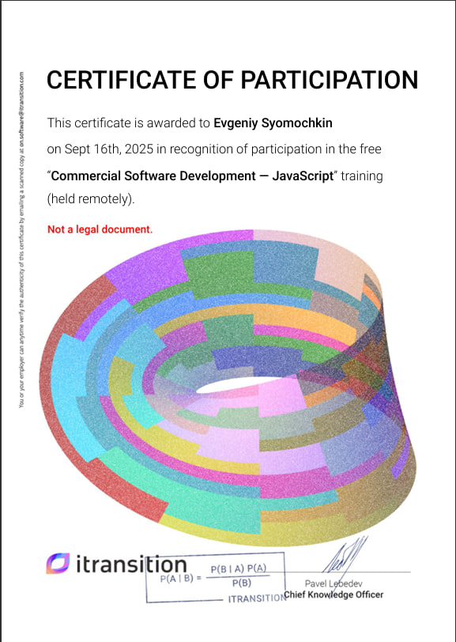

# Сёмочкин Евгений
### Frontend Developer

---
---

**Gmail:** jekasemo4kin@gmail.com  

**VK:** https://vk.com/v13ss  

**Telegram:** @jekasemo4kin  

**GitHub** https://github.com/jekasemo4kin

---
---

### Обо мне

Начинающий frontend developer. Хочу развиваться и быть полезным в интересной мне области.
Развиваю свой английский язык. В будущем буду готов к коммуникации на английском.

---
---

### Навыки:

- HTML5 
- CSS
- SCSS
- PHP
- JavaScript
- TypeScript
- ReactJS
- TailWindCSS
- Vite
- GitHub
- NodeJS Basics
- Figma Basics
- MySQL, SQL, PostgreSQL
- Prisma
- Деплой Render и Vercel

---
---

### Пет проекты:
1 - https://task-7-of-the-internship-frontend-v.vercel.app/
2 - https://you-tube-helper-frontend.vercel.app/
---
---

### Опыт работы:

**- Стажёр Frontend разработчик**  

Успешно пройденная “Commercial Software Development — JavaScript” training компании Itranstion.  
Опыт работы - 2 месяца. 

**- Инженер по техническим средствам**  

Был инженером электриком с техником в моём подчинении.  
Опыт работы - 2 года.  

**- Сторож школы во времена студенчества**  

Опыт работы - 2 года.  

---
---

### Образование:

- Высшее техническое образование полученное в БРУ г.Могилёва по специальности "Автоматизированные электроприводы". Закончил летом 2022 года.
- Самообразование (learnjavascript, MDN, статьи на Хабре, видеоуроки, пет-проекты в гите).
- Курс Frontend developer от RS-School.
- Стажировка Frontend developer от компании Itransition

---
---

